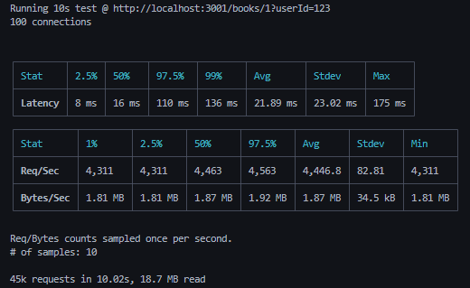

# Valita

Valita is a minimal, composable HTTP toolkit for Node.js and AWS Lambda. It gives you an Express-like routing API with first-class Zod validation, predictable request/response shapes.

## Features

- **Routing primitives** — Register `get`, `post`, `put`, and `del` routes with familiar path patterns and Express-style params (`/books/:id`).
- **Middleware pipeline** — Chain any number of middleware functions before your controller. Each middleware can short-circuit by returning a response or continue by returning `undefined`.
- **Schema validation** — Attach Zod schemas to `params`, `query`, `body`, `headers`, and `cookies`. Requests are validated automatically and fail with consistent `400` responses.
- **Server + Lambda adapters** — Use `createServer` for Node’s `http` module or `createLambda` for AWS Lambda/API Gateway — same routes, same handlers.
- **Typed contracts** — `Request`, `Response`, `Schema`, `ControllerFn`, and `MiddlewareFn` types ship with the library so your editor sees the same shapes Valita expects.

## Installation

```bash
npm install valita-server zod
# or
yarn add valita-server zod
```

## Quick Start (Node HTTP Server)

```ts
// src/app.ts
import { createServer, get, log } from "valita-server";
import { z } from "zod";

// Register routes by importing the file once at startup.
get(
    "/hello/:name",
    {
        params: z.object({ name: z.string().min(1) }),
        query: z.object({ excited: z.coerce.boolean() }),
    },
    (req) => ({
        status: 200,
        body: {
            greeting: `Hello ${req.params.name}${req.query.excited ? "!" : "."}`,
        },
    }),
);

const server = createServer({
    errorHandler: (err) => {
        console.error("Unhandled error", err);
        return {
            status: 500,
            body: { message: "Internal server error" },
        };
    },
    enableRequestLogging: true,
    enableResponseLogging: true,
    loggerFn: log.info,
});

server.listen(3000, () => {
    console.log("Server listening on http://localhost:3000");
});
```

> **Tip:** Routes are stored in-process. Import your `routes/*.ts` modules before calling `createServer`/`createLambda` to ensure everything is registered.

## Middleware Pipeline

Middleware are functions that receive the request and either return a `Response` (to short-circuit) or `undefined` to pass control to the next middleware or controller.

```ts
import { get, Request } from "valita-server";

function authMiddleware(req: Request) {
    if (!req.headers.authorization) {
        return {
            status: 401,
            body: { message: "Unauthorized" },
        };
    }
}

get("/secure", authMiddleware, (req) => ({
    status: 200,
    body: { user: req.headers.authorization },
}));
```

## Request Validation with Zod

Attach a schema object anywhere in the middleware chain. Valita merges the pieces into a Zod object and validates the request before hitting your controller.

```ts
import { get } from "valita-server";
import { z } from "zod";

const bookSchema = {
    params: z.object({ id: z.coerce.number().int().positive() }),
    query: z.object({ include: z.enum(["reviews", "author"]).optional() }),
};

get("/books/:id", bookSchema, (req) => ({
    status: 200,
    body: { id: req.params.id, include: req.query.include },
}));
```

If validation fails, Valita throws a `ValidationError` that is translated into:

```json
{
    "status": 400,
    "body": {
        "message": "Validation failed",
        "error": { "...": "zod-formatted error details" }
    }
}
```

You can catch and report these errors differently by providing a custom `errorHandler` (see below).

## AWS Lambda Handler

Use the same routes and controllers with the Lambda adapter:

```ts
// lambda.ts
require("./routes/book.routes"); // registers routes once

import { createLambda } from "valita-server";

export const handler = createLambda({});
```

Deploy it behind API Gateway and Valita will translate the event into the same request object your controllers expect.

## Error Handling & Logging Options

Both `createServer` and `createLambda` accept an optional `Options` object:

- `errorHandler?: (err: Error) => Response` — Return a custom response for uncaught errors. If omitted, Valita sends a `500` or `400` for `ValidationError`.
- `enableRequestLogging?: boolean` — When `true`, every request is passed to `logRequest(path, data)`.
- `enableResponseLogging?: boolean` — When `true`, every response is passed to `logResponse(path, response)`.
- `loggingFn?: LoggerFn` — Override the logging function used by both `logRequest` and `logResponse` (defaults to `console.log`).

## Example: Bookstore API

The repository ships with a runnable example under `example/bookstore` that demonstrates:

- Registering routes with middleware and schemas
- Serving the same routes via a local HTTP server (`bookstore.app.ts`)
- Exporting the same logic as an AWS Lambda handler (`bookstore-lambda.ts`)

### Try it locally

```bash
npm install
ts-node example/valita-bookstore/bookstore.app.ts
# Visit http://localhost:3000/books?userId=123
```

### Try it with Serverless Offline

```bash
npm install
npm run example-serverless
```

Then send requests to the endpoints exposed in `example/valita-bookstore/serverless.yml`.

### Logging

Valita uses [batch-stdout](https://www.npmjs.com/package/batch-stdout?activeTab=readme) for logging by default. If providing a custom logging function, I highly recommend avoiding using console/process.stdout as logging is quite expensive (can cut throughput in half if using request & response logging).
Valita exposes it's batch-stdout logger.

```ts
import { log, createServer } from "valita-server";

function loggingFn(message: string, obj: any) {
    log.info(message, obj);
}

createServer({
    loggingFn,
}).listen(3000);
```

### Benchmark vs Express.js

Ran benchmark through [autocannon script](./example/autocannon.ps1). Not an exact science, but gives an idea of Valita vs Express

#### Valita


#### Express



## Contributing

1. Clone the repo and install dependencies (`npm install`).
2. Run the test suite (`npm test`).
3. Format/lint as needed (`npm run lint`).

Issues and pull requests are welcome!

## License

MIT © OkayestDev
