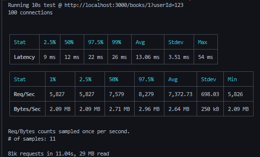
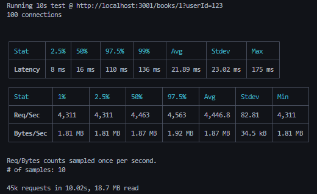

# Valita

Valita is a minimal, composable HTTP toolkit for Node.js and AWS Lambda. It gives you an Express-like routing API with first-class Zod validation, predictable request/response shapes.

## Features

- **Routing primitives** — Register `get`, `post`, `put`, and `del` routes with familiar path patterns and Express-style params (`/books/:id`).
- **Global OPTIONS handler** — Set `optionsHandler` on `createServer` to answer `OPTIONS` requests (such as CORS preflights) when no route matches.
- **Middleware pipeline** — Chain any number of middleware functions before your controller. Each middleware can short-circuit by returning a response or continue by returning `undefined`.
- **Schema validation** — Attach Zod schemas to `params`, `query`, `body`, `headers`, and `cookies`. Requests are validated automatically and fail with consistent `400` responses.
- **File uploads** — `multipart/form-data` is parsed in the Node and Lambda adapters. Text fields stay on `request.body`. Files are on `request.files`.
- **Server + Lambda adapters** — Use `createServer` for Node’s `http` module or `createLambda` for AWS Lambda/API Gateway — same routes, same handlers.
- **Typed contracts** — `Request`, `Response`, `Schema`, `ControllerFn`, `MiddlewareFn`, and `UploadedFile` types ship with the library so your editor sees the same shapes Valita expects.

## Installation

```bash
npm install valita-server zod
# or
yarn add valita-server zod
```

## Quick Start (Node HTTP Server)

```ts
// src/app.ts
import { createServer, get, log } from "valita-server";
import { z } from "zod";

// Register routes by importing the file once at startup.
get(
    "/hello/:name",
    {
        params: z.object({ name: z.string().min(1) }),
        query: z.object({ excited: z.coerce.boolean() }),
    },
    (req) => ({
        status: 200,
        body: {
            greeting: `Hello ${req.params.name}${req.query.excited ? "!" : "."}`,
        },
    }),
);

const server = createServer({
    errorHandler: (err) => {
        console.error("Unhandled error", err);
        return {
            status: 500,
            body: { message: "Internal server error" },
        };
    },
    enableRequestLogging: true,
    enableResponseLogging: true,
    loggerFn: log.info,
});

server.listen(3000, () => {
    console.log("Server listening on http://localhost:3000");
});
```

> **Tip:** Routes are stored in-process. Import your `routes/*.ts` modules before calling `createServer`/`createLambda` to ensure everything is registered.

## Middleware Pipeline

Middleware are functions that receive the request and either return a `Response` (to short-circuit) or `undefined` to pass control to the next middleware or controller.

```ts
import { get, Request } from "valita-server";

function authMiddleware(req: Request) {
    if (!req.headers.authorization) {
        return {
            status: 401,
            body: { message: "Unauthorized" },
        };
    }
}

get("/secure", authMiddleware, (req) => ({
    status: 200,
    body: { user: req.headers.authorization },
}));
```

## Request Validation with Zod

Attach a schema object anywhere in the middleware chain. Valita merges the pieces into a Zod object and validates the request before hitting your controller.

```ts
import { get } from "valita-server";
import { z } from "zod";

const bookSchema = {
    params: z.object({ id: z.coerce.number().int().positive() }),
    query: z.object({ include: z.enum(["reviews", "author"]).optional() }),
};

get("/books/:id", bookSchema, (req) => ({
    status: 200,
    body: { id: req.params.id, include: req.query.include },
}));
```

If validation fails, Valita throws a `ValidationError` that is translated into:

```json
{
    "status": 400,
    "body": {
        "message": "Validation failed",
        "error": { "...": "zod-formatted error details" }
    }
}
```

You can catch and report these errors differently by providing a custom `errorHandler` (see below).

## File Uploads

Send `multipart/form-data`. Valita reads the body in the adapter before your route runs, so a middleware does not have to touch the raw stream. Text fields are strings on `request.body`. Each file is on `request.files`, keyed by its field name:

```ts
import { post, UploadedFile } from "valita-server";

function oneFile(file: UploadedFile | UploadedFile[] | undefined) {
    if (!file) {
        return undefined;
    }
    return Array.isArray(file) ? file[0] : file;
}

post("/books/:id/cover", (req) => {
    const cover = oneFile(req.files.cover);
    if (!cover) {
        return { status: 400, body: { message: "Cover file is required" } };
    }
    return {
        status: 201,
        body: {
            filename: cover.filename,
            mediaType: cover.mediaType,
            size: cover.data.length,
        },
    };
});
```

`UploadedFile` is `{ filename, mediaType, data }`, and `data` is a `Buffer`. A repeated field name becomes an array, the same way repeated query keys do. A Zod `body` schema still validates the text fields. `caption` on the bookstore cover route is an optional string.

```bash
curl -X POST "http://localhost:3000/books/1/cover?userId=123" \
  -F "caption=Front cover" \
  -F "cover=@cover.png;type=image/png"
```

Bodies are limited to 10 MB by default. Set `maxBodyBytes` on `createServer` or `createLambda` to change that. A larger body returns `413` and `{ "message": "Request body too large" }`.

Other body errors:

- Invalid JSON returns `400` and `{ "message": "Invalid JSON body" }`.
- A malformed multipart body returns `400` and `{ "message": "Invalid multipart body" }` (or a more specific message, such as a missing boundary).

`JsonBodyError`, `MultipartError`, and `PayloadTooLargeError` are exported. A custom `errorHandler` replaces the default, so it has to map those errors if you want these status codes.

The parser is a single-level `multipart/form-data` reader. Parts are separated by CRLF and the boundary. It does not expand nested multiparts or `filename*` encoding. On Lambda, API Gateway must pass the body through with `isBase64Encoded: true`. The API Gateway payload limit is 6 MB, which is below Valita's default body limit.

## AWS Lambda Handler

Use the same routes and controllers with the Lambda adapter:

```ts
// lambda.ts
require("./routes/book.routes"); // registers routes once

import { createLambda } from "valita-server";

export const handler = createLambda({});
```

Deploy it behind API Gateway and Valita will translate the event into the same request object your controllers expect.

## Error Handling & Logging Options

Both `createServer` and `createLambda` accept an optional `Options` object:

- `errorHandler?: (err: Error) => Response` — Return a custom response for uncaught errors. If omitted, Valita sends a `500` or `400` for `ValidationError`.
- `enableRequestLogging?: boolean` — When `true`, every request is passed to `logRequest(path, data)`.
- `enableResponseLogging?: boolean` — When `true`, every response is passed to `logResponse(path, response)`.
- `loggingFn?: LoggerFn` — Override the logging function used by both `logRequest` and `logResponse` (defaults to `console.log`).
- `optionsHandler?: OptionsHandler` — Global handler for `OPTIONS` requests that do not match a registered route. `createServer` installs this handler. It receives the `Request` and returns a `Response` or `Promise<Response>`. If omitted, Valita responds with `404` and `{ message: "No OPTIONS route provided and no options handler set" }`. See [Global OPTIONS Handler](#global-options-handler).
- `maxBodyBytes?: number` — Maximum request body size in bytes. Defaults to 10 MB. A larger body returns `413`.

## Global OPTIONS Handler

`OPTIONS` requests that do not match a registered route are passed to `optionsHandler` when you set it on `createServer`. A typical use is answering CORS preflights for every path:

```ts
import { createServer } from "valita-server";

createServer({
    optionsHandler: (req) => ({
        status: 204,
        headers: {
            "Access-Control-Allow-Origin": req.headers.origin ?? "*",
            "Access-Control-Allow-Methods": "GET, POST, PUT, DELETE, OPTIONS",
            "Access-Control-Allow-Headers": "Content-Type, Authorization",
        },
    }),
}).listen(3000);
```

The handler can be async. `createLambda` does not install `optionsHandler`; configure CORS for Lambda at API Gateway, or handle `OPTIONS` inside your own adapter.

## Example: Bookstore API

The repository ships with a runnable example under `example/bookstore` that demonstrates:

- Registering routes with middleware and schemas
- Serving the same routes via a local HTTP server (`bookstore.app.ts`)
- Uploading a book cover with `POST /books/:id/cover` (`upload-cover.controller.ts`)
- Answering unmatched `OPTIONS` requests with a global `optionsHandler` (`bookstore.app.ts`)
- Exporting the same logic as an AWS Lambda handler (`bookstore-lambda.ts`)

### Try it locally

```bash
npm install
ts-node example/valita-bookstore/bookstore.app.ts
# Visit http://localhost:3000/books?userId=123
```

With the example server running, upload the sample cover:

```powershell
powershell -ExecutionPolicy Bypass -File .\example\valita-bookstore\file-upload.ps1
```

That posts `example/valita-bookstore/cover.png` to `POST /books/1/cover?userId=123` and checks for a `201`. Pass `-FilePath` to send a different file.

### Try it with Serverless Offline

```bash
npm install
npm run example-serverless
```

Then send requests to the endpoints exposed in `example/valita-bookstore/serverless.yml`.

### Logging

Valita uses [batch-stdout](https://www.npmjs.com/package/batch-stdout?activeTab=readme) for logging by default. If providing a custom logging function, I highly recommend avoiding using console/process.stdout as logging is quite expensive (can cut throughput in half if using request & response logging).
Valita exposes it's batch-stdout logger.

```ts
import { log, createServer } from "valita-server";

function loggingFn(message: string, obj: any) {
    log.info(message, obj);
}

createServer({
    loggingFn,
}).listen(3000);
```

### Benchmark vs Express.js

Ran benchmark through [autocannon script](./example/autocannon.ps1). Not an exact science, but gives an idea of Valita vs Express

#### Valita



#### Express



## Contributing

1. Clone the repo and install dependencies (`npm install`).
2. Run the test suite (`npm test`).
3. Format/lint as needed (`npm run lint`).

Issues and pull requests are welcome!

## License

MIT © OkayestDev
